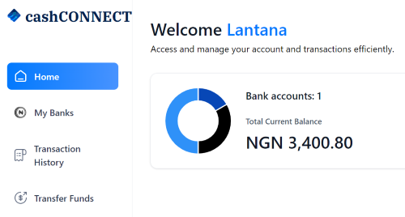

# cashCONNECT

Welcome to cashCONNECT - A modern online banking app designed to make your financial management seamless and secure.

## About

cashCONNECT leverages the power of Next.js combined with Typescript and JavaScript to deliver an exceptional user experience while ensuring robust performance and maintainability.

## Features

- **Real-time Account Balance**: Stay updated with your spending with our real-time balance feature.
- **Transaction Efficiency**: Experience smooth and fast transaction processing.
- **Secure Authentication**: Your security is our priority; enjoy peace of mind with our secure login systems.
- **Intuitive Interface**: Our user-friendly interface makes online banking accessible for everyone.

## Getting Started

To get started using cashCONNECT:

1. Clone this repository.
2. Install dependencies using `npm install`.
3. Start the development server using `npm run dev`.
4. Open `localhost:3000` in your browser to view the app.

## Technologies Used

- **Next.js**: A React framework for production-level applications.
- **TypeScript**: Ensures type safety across your codebase.
- **JavaScript**: Adds interactive functionalities to enhance user experience.

## Contributions

We welcome contributions from developers of all skill levels! If you're interested in improving cashCONNECT, feel free to fork this repository, make changes, and submit a pull request!

Thank you for choosing cashCONNECT as your trusted online banking partner!
